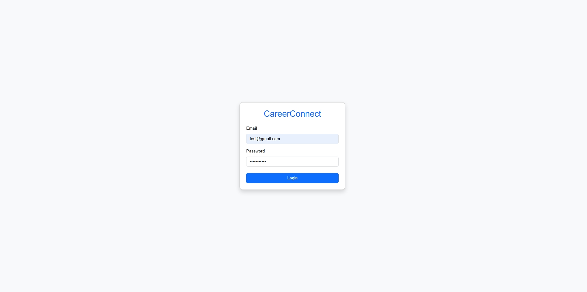
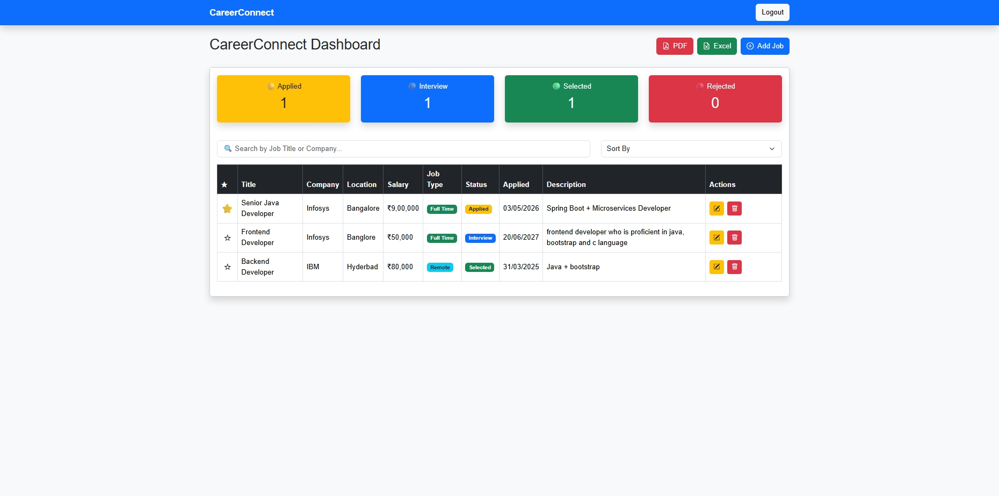
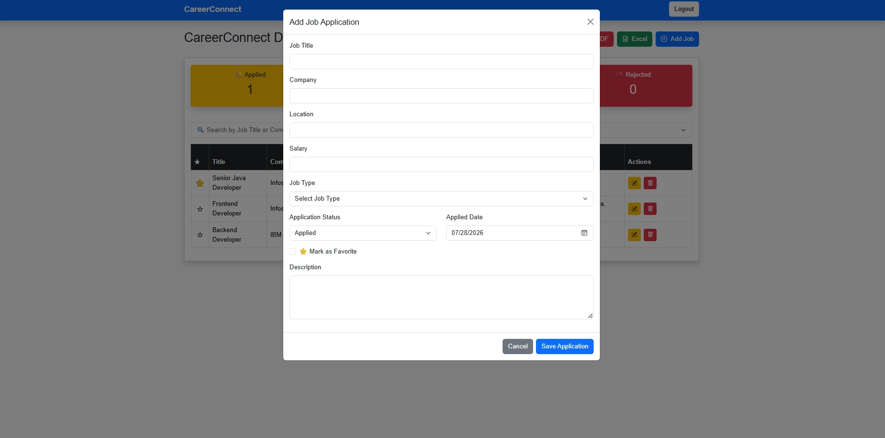
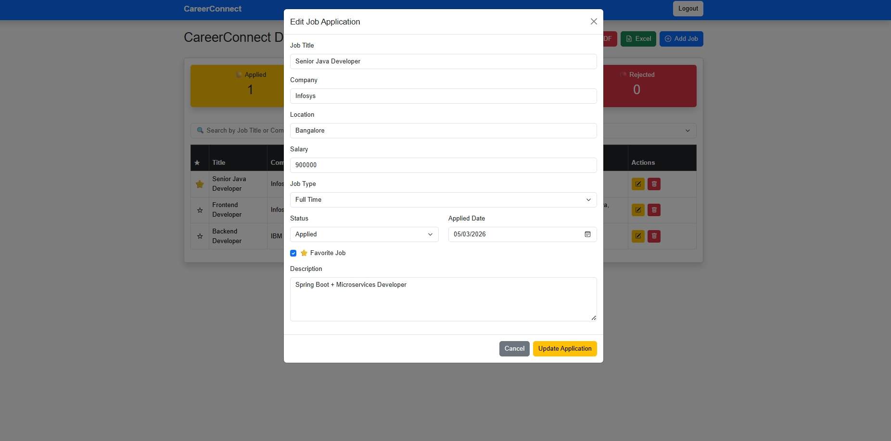
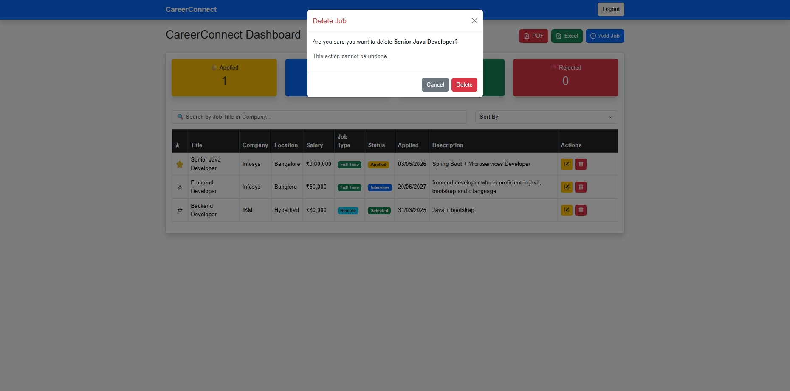
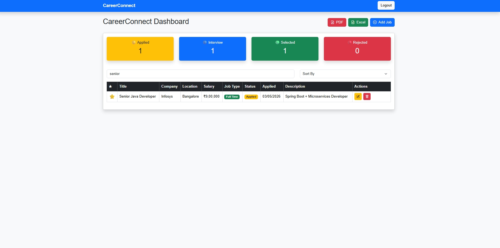
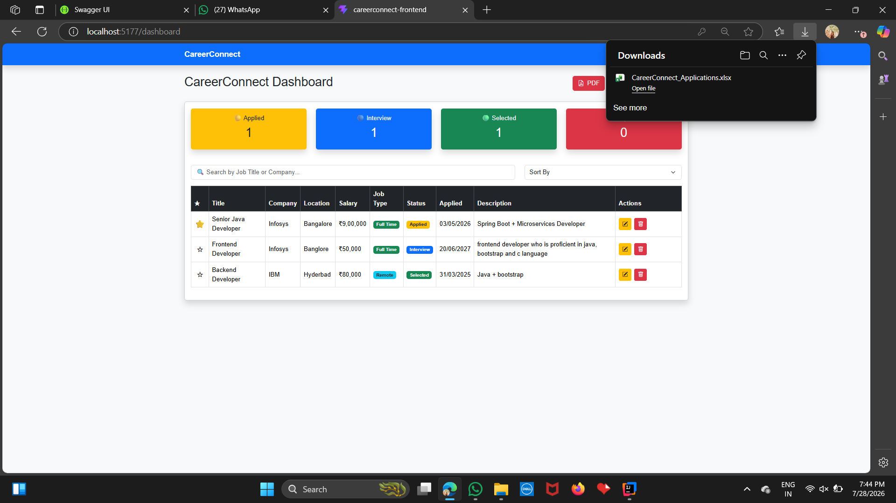

# CareerConnect 🚀

A full-stack Job Application Tracker built with **Spring Boot**, **React**, **MySQL**, and **JWT Authentication**. CareerConnect helps users securely manage and track their job applications through an intuitive dashboard with powerful management features.

---

## ✨ Features

### 🔐 Authentication
- User Registration & Login
- JWT Authentication
- Password Encryption using BCrypt
- Protected Routes

### 💼 Job Management
- Add New Jobs
- Update Job Details
- Delete Jobs
- View All Applications
- Search Jobs
- Sort Applications
- Pagination Support

### 📊 Dashboard
- Total Applications
- Applied Jobs
- Interview Jobs
- Offer Jobs
- Rejected Jobs
- Responsive Dashboard Cards

### 📈 Reports
- Export Jobs to PDF
- Export Jobs to Excel

### 🎨 User Interface
- Responsive Design
- Bootstrap 5
- Clean and Modern UI

---

# 🛠 Tech Stack

## Frontend
- React
- Vite
- Bootstrap 5
- Axios
- React Router DOM

## Backend
- Spring Boot
- Spring Security
- Spring Data JPA
- JWT Authentication
- Maven

## Database
- MySQL

---

# 📂 Project Structure

```
CareerConnect/
│
├── src/                         # Spring Boot Backend
├── pom.xml
├── careerconnect-frontend/
│   ├── src/
│   ├── public/
│   ├── package.json
│   └── vite.config.js
│
└── README.md
```

---

# ⚙️ Installation

## 1️⃣ Clone Repository

```bash
git clone https://github.com/Harshitha-Sudhakar20/CareerConnect.git
cd CareerConnect
```

---

## 2️⃣ Backend Setup

Configure your MySQL database inside:

```
src/main/resources/application.properties
```

Run the backend:

```bash
mvn spring-boot:run
```

Backend runs at:

```
http://localhost:8080
```

---

## 3️⃣ Frontend Setup

```bash
cd careerconnect-frontend
npm install
npm run dev
```

Frontend runs at:

```
http://localhost:5173
```

---

# 🔑 API Features

- JWT Authentication
- User Login
- User Registration
- CRUD Operations
- Secure REST APIs

---

## 📸 Screenshots

### Login Page


### Dashboard


### Add Job


### Edit Job


### Delete Job


### Search


### PDF Export


### Excel Export


# 🚀 Future Enhancements

- Email Notifications
- Resume Upload
- Company Logo Upload
- Dark Mode
- Interview Reminder
- Job Analytics
- Profile Management
- Cloud Deployment

---

# 👩‍💻 Author

**Harshitha Sudhakar**

GitHub:
https://github.com/Harshitha-Sudhakar20

---

# ⭐ Support

If you found this project helpful, consider giving it a ⭐ on GitHub.
